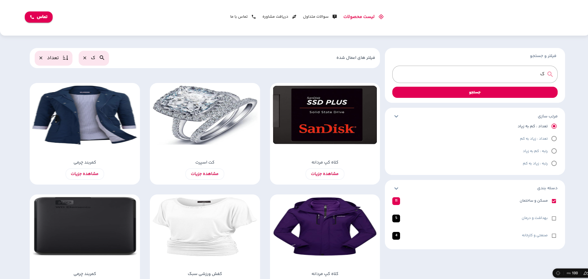

# 🛍️ Nuxt 3  Mini E-Commerce (Frontend Challenge project)

> 🧱 This is a responsive frontend-only e-commerce challenge project built using **Nuxt 3**, **Vue 3**, **Vuetify 3**.

> 🎯 The goal was to demonstrate a real product listing UI, clean architecture, and responsive layout logic using modern Vue ecosystem tools.

> 💡 The application fetches data from [FakeStore API](https://fakestoreapi.com) and implements local filtering and sorting to simulate real-world e-commerce behavior — without backend interaction.
> 🧪 fetched data manipulated on the client (due to limitations of the FakeStore API).

---

## 🌟  Key Features
- ✅ **Fully component-based architecture**
- ✅ Follows **Clean Code** & **SOLID principles**
- ✅ Responsive design for **mobile and desktop**
- ✅ Data filtered client-side only (fake API limitation)
- ✅ Lightweight and scalable state management using only **props** - No Vuex used
- ✅ Pages developed:
  - Product Listing Page
  - Single Product Detail Page

---

## 🧰 Tech Stack

| Technology     | Version |
|----------------|---------|
| Vue            | 3.5.13  |
| Nuxt           | 3.17.3  |
| Vuetify        | 3.8.5   |
| Sass           | ^1.89.0 |
| Axios          | 1.9.0   |
| FakeStore API  | [🔗](https://fakestoreapi.com) |


---

## 📸 UI Preview



---

## 🚀 Getting Started

```bash
# 1. Clone the repo
git clone https://github.com/shayanbazargan/samarTeck-challenge.git

# 2. Go to project directory
cd samarTeck-challenge

# 3. Install dependencies
npm install

# 4. Run dev server
npm run dev

````
